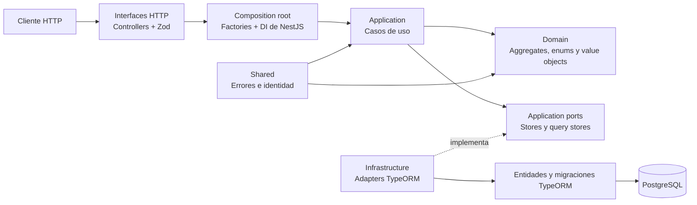
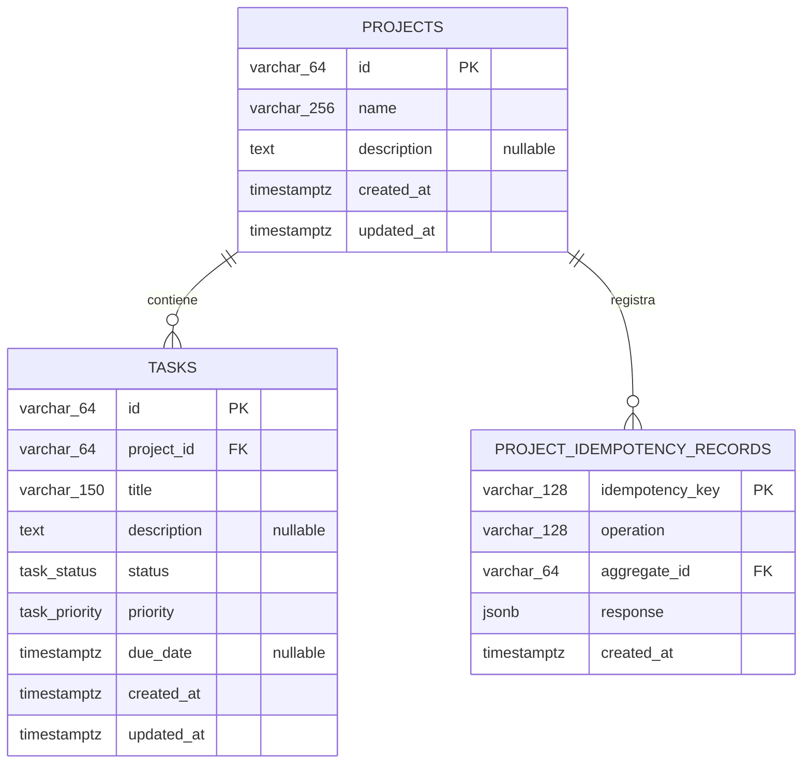

# Task Manager Backend

API REST para gestionar proyectos y sus tareas. Está construida con NestJS,
TypeScript, TypeORM y PostgreSQL, separando dominio, casos de uso, puertos e
infraestructura.

## Requisitos

- Node.js 22 o superior.
- pnpm 9.
- Docker con Docker Compose.

## Ejecución local

1. Entra al proyecto:

   ```bash
   cd task-manager-backend
   ```

2. Instala las dependencias:

   ```bash
   pnpm install --frozen-lockfile
   ```

3. Crea el archivo de variables locales:

   ```bash
   cp .env.example .env
   ```

   Los valores del ejemplo levantan PostgreSQL en `localhost:5432`. Si ese
   puerto está ocupado, cambia `DB_PORT` tanto para Docker como para la API.

4. Inicia PostgreSQL:

   ```bash
   docker compose up -d db
   ```

5. Ejecuta las migraciones:

   ```bash
   pnpm run migration:run
   ```

6. Inicia la API en modo desarrollo:

   ```bash
   pnpm run start:dev
   ```

7. Comprueba que esté disponible:

   ```bash
   curl http://localhost:3000/health
   ```

   La respuesta esperada es:

   ```json
   { "status": "ok" }
   ```

Para detener la base de datos:

```bash
docker compose down
```

El volumen `db_data` conserva los datos. Usa `docker compose down --volumes`
solo si quieres eliminarlos.

## Variables de entorno

| Variable       | Requerida      | Valor local    | Descripción                                                      |
| -------------- | -------------- | -------------- | ---------------------------------------------------------------- |
| `PORT`         | No             | `3000`         | Puerto HTTP de la API.                                           |
| `CORS_ORIGINS` | No             | URLs de Vite   | Orígenes permitidos, separados por comas.                        |
| `DB_HOST`      | Sí en local    | `localhost`    | Host de PostgreSQL.                                              |
| `DB_PORT`      | No             | `5432`         | Puerto de PostgreSQL.                                            |
| `DB_USERNAME`  | Sí en local    | `admin`        | Usuario de PostgreSQL.                                           |
| `DB_PASSWORD`  | Sí en local    | `pass`         | Contraseña de PostgreSQL.                                        |
| `DB_DATABASE`  | Sí en local    | `task_manager` | Nombre de la base de datos.                                      |
| `DB_SSL`       | No             | `false`        | Activa SSL en la conexión.                                       |
| `DATABASE_URL` | Solo en Render | —              | Reemplaza las variables `DB_*` de conexión cuando está definida. |

## Endpoints

Todos los cuerpos y respuestas usan JSON, excepto las respuestas `204`.

| Método   | Ruta                                 | Entrada                                                      | Respuesta exitosa      | Descripción                                   |
| -------- | ------------------------------------ | ------------------------------------------------------------ | ---------------------- | --------------------------------------------- |
| `GET`    | `/health`                            | —                                                            | `200`                  | Comprueba la disponibilidad de la API.        |
| `POST`   | `/projects`                          | Header `Idempotency-Key`; body `name`, `description?`        | `201`; `200` en replay | Crea un proyecto de forma idempotente.        |
| `GET`    | `/projects`                          | —                                                            | `200`                  | Lista los proyectos.                          |
| `GET`    | `/projects/:projectId`               | Path `projectId`                                             | `200`                  | Consulta un proyecto.                         |
| `PATCH`  | `/projects/:projectId`               | `name?`, `description?`                                      | `200`                  | Actualiza al menos un campo del proyecto.     |
| `DELETE` | `/projects/:projectId`               | Path `projectId`                                             | `204`                  | Elimina el proyecto y sus datos dependientes. |
| `GET`    | `/projects/:projectId/summary`       | Path `projectId`                                             | `200`                  | Obtiene indicadores de tareas del proyecto.   |
| `POST`   | `/projects/:projectId/tasks`         | `title`, `description?`, `priority?`, `dueDate?`             | `201`                  | Crea una tarea en estado `pending`.           |
| `GET`    | `/projects/:projectId/tasks`         | Query `status?`, `priority?`, `search?`                      | `200`                  | Lista y filtra las tareas del proyecto.       |
| `GET`    | `/projects/:projectId/tasks/:taskId` | Paths `projectId`, `taskId`                                  | `200`                  | Consulta una tarea del proyecto.              |
| `PATCH`  | `/projects/:projectId/tasks/:taskId` | `title?`, `description?`, `status?`, `priority?`, `dueDate?` | `200`                  | Actualiza al menos un campo de la tarea.      |
| `DELETE` | `/projects/:projectId/tasks/:taskId` | Paths `projectId`, `taskId`                                  | `204`                  | Elimina una tarea.                            |

### Valores permitidos

- `status`: `pending`, `in-progress`, `completed`.
- `priority`: `low`, `medium`, `high`.
- `dueDate`: fecha ISO 8601 con offset; acepta `null` al actualizar.
- `search`: hasta 150 caracteres; busca en título y descripción.

El resumen tiene esta forma:

```json
{
  "total": 12,
  "byStatus": {
    "pending": 4,
    "inProgress": 3,
    "completed": 5
  },
  "byPriority": {
    "low": 2,
    "medium": 7,
    "high": 3
  },
  "overdue": 2,
  "completionPercentage": 41.67
}
```

Los errores siguen un contrato uniforme:

```json
{
  "error": {
    "code": "task.not-found",
    "message": "Task was not found",
    "layer": "application",
    "category": "not-found",
    "retryable": false
  }
}
```

## Arquitectura interna

La aplicación sigue una arquitectura hexagonal por módulo. El dominio no
depende de NestJS, TypeORM ni PostgreSQL.



Responsabilidades principales:

- `apps/api`: configuración, composición de dependencias y controladores HTTP.
- `libs/project`: dominio, casos de uso y persistencia de proyectos.
- `libs/task`: dominio, casos de uso, filtros, resumen y persistencia de tareas.
- `libs/shared`: errores comunes y generación de identificadores.
- `test`: pruebas unitarias y HTTP E2E separadas de la implementación.

## Modelo de datos



- Al eliminar un proyecto, PostgreSQL elimina en cascada sus tareas y registros
  de idempotencia.
- `tasks` tiene un índice compuesto por `project_id`, `status` y `priority`.
- `project_idempotency_records` tiene un índice sobre `aggregate_id`.
- `task_status` admite `pending`, `in-progress` y `completed`.
- `task_priority` admite `low`, `medium` y `high`.

## Scripts útiles

| Comando                       | Descripción                           |
| ----------------------------- | ------------------------------------- |
| `pnpm run start:dev`          | Inicia NestJS en modo watch.          |
| `pnpm run build`              | Genera el build en `dist`.            |
| `pnpm run start:prod`         | Ejecuta el build compilado.           |
| `pnpm run migration:run`      | Ejecuta migraciones desde TypeScript. |
| `pnpm run migration:run:prod` | Ejecuta migraciones compiladas.       |
| `pnpm run migration:revert`   | Revierte la última migración local.   |
| `pnpm run lint`               | Ejecuta ESLint.                       |
| `pnpm test -- --runInBand`    | Ejecuta toda la suite de pruebas.     |

## Despliegue en Render

El archivo [`../render.yaml`](../render.yaml) define la API, PostgreSQL y la UI.
La API ejecuta las migraciones antes de iniciar y Render consulta `/health` para
validar cada despliegue.
