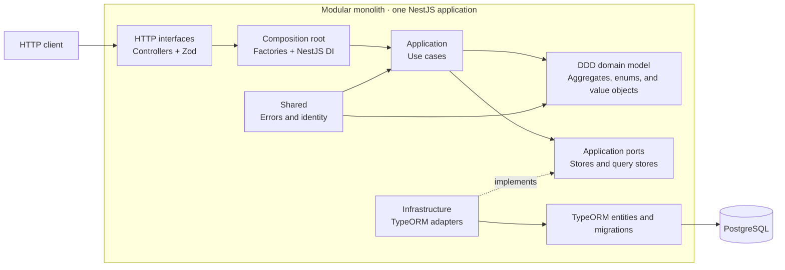

# Task Manager Backend

REST API for managing projects and their tasks. It is built as a **modular
monolith** with NestJS, TypeScript, TypeORM, and PostgreSQL. It is deployed as a
single application while maintaining explicit boundaries between the project,
task, and shared modules. The internal design applies **Domain-Driven Design
(DDD)** and hexagonal architecture.

## Requirements

- Node.js 22 or later.
- pnpm 9.
- Docker with Docker Compose.

## Local setup

1. Enter the project directory:

   ```bash
   cd task-manager-backend
   ```

2. Install dependencies:

   ```bash
   pnpm install --frozen-lockfile
   ```

3. Create the local environment file:

   ```bash
   cp .env.example .env
   ```

   The example values run PostgreSQL at `localhost:5432`. If that port is
   already in use, change `DB_PORT` for both Docker and the API.

4. Start PostgreSQL:

   ```bash
   docker compose up -d db
   ```

5. Run the migrations:

   ```bash
   pnpm run migration:run
   ```

6. Start the API in development mode:

   ```bash
   pnpm run start:dev
   ```

7. Check that it is available:

   ```bash
   curl http://localhost:3000/health
   ```

   Expected response:

   ```json
   { "status": "ok" }
   ```

To stop the database:

```bash
docker compose down
```

The `db_data` volume preserves the data. Use
`docker compose down --volumes` only when you want to delete it.

## Environment variables

| Variable       | Required  | Local value    | Description                                                    |
| -------------- | --------- | -------------- | -------------------------------------------------------------- |
| `NODE_ENV`     | No        | `development`  | Use `production` to emit logs as single-line JSON.             |
| `PORT`         | No        | `3000`         | API HTTP port.                                                 |
| `CORS_ORIGINS` | No        | Vite URLs      | Allowed origins, separated by commas.                          |
| `DB_HOST`      | Locally   | `localhost`    | PostgreSQL host.                                               |
| `DB_PORT`      | No        | `5432`         | PostgreSQL port.                                               |
| `DB_USERNAME`  | Locally   | `admin`        | PostgreSQL user.                                               |
| `DB_PASSWORD`  | Locally   | `pass`         | PostgreSQL password.                                           |
| `DB_DATABASE`  | Locally   | `task_manager` | Database name.                                                 |
| `DB_SSL`       | No        | `false`        | Enables SSL for the database connection.                       |
| `DATABASE_URL` | On Render | —              | Replaces the connection-related `DB_*` variables when defined. |

## Endpoints

All request and response bodies use JSON except for `204` responses.

| Method   | Route                                | Input                                                        | Successful response    | Description                                 |
| -------- | ------------------------------------ | ------------------------------------------------------------ | ---------------------- | ------------------------------------------- |
| `GET`    | `/health`                            | —                                                            | `200`                  | Checks API availability.                    |
| `POST`   | `/projects`                          | `Idempotency-Key` header; `name`, `description?` body        | `201`; `200` on replay | Creates a project idempotently.             |
| `GET`    | `/projects`                          | —                                                            | `200`                  | Lists projects.                             |
| `GET`    | `/projects/:projectId`               | `projectId` path parameter                                   | `200`                  | Retrieves a project.                        |
| `PATCH`  | `/projects/:projectId`               | `name?`, `description?`                                      | `200`                  | Updates at least one project field.         |
| `DELETE` | `/projects/:projectId`               | `projectId` path parameter                                   | `204`                  | Deletes the project and its dependent data. |
| `GET`    | `/projects/:projectId/summary`       | `projectId` path parameter                                   | `200`                  | Retrieves project task indicators.          |
| `POST`   | `/projects/:projectId/tasks`         | `title`, `description?`, `priority?`, `dueDate?`             | `201`                  | Creates a task with `pending` status.       |
| `GET`    | `/projects/:projectId/tasks`         | `status?`, `priority?`, `search?` query parameters           | `200`                  | Lists and filters project tasks.            |
| `GET`    | `/projects/:projectId/tasks/:taskId` | `projectId`, `taskId` path parameters                        | `200`                  | Retrieves a task from the project.          |
| `PATCH`  | `/projects/:projectId/tasks/:taskId` | `title?`, `description?`, `status?`, `priority?`, `dueDate?` | `200`                  | Updates at least one task field.            |
| `DELETE` | `/projects/:projectId/tasks/:taskId` | `projectId`, `taskId` path parameters                        | `204`                  | Deletes a task.                             |

### Allowed values

- `status`: `pending`, `in-progress`, `completed`.
- `priority`: `low`, `medium`, `high`.
- `dueDate`: ISO 8601 date with an offset; accepts `null` when updating.
- `search`: up to 150 characters; searches titles and descriptions.

The project summary has the following shape:

```json
{
  "total": 12,
  "byStatus": {
    "pending": 4,
    "inProgress": 3,
    "completed": 5
  },
  "byPriority": {
    "low": 2,
    "medium": 7,
    "high": 3
  },
  "overdue": 2,
  "completionPercentage": 41.67
}
```

Errors follow a consistent contract:

```json
{
  "error": {
    "code": "task.not-found",
    "message": "Task was not found",
    "layer": "application",
    "category": "not-found",
    "retryable": false
  }
}
```

## Logging

The API logs the HTTP request lifecycle without recording request bodies,
credentials, or sensitive headers. Each entry includes an event name, request
ID, method, path, and—when the request finishes—its status code and duration.
Responses from `400` to `499` use the warning level, while `500` responses and
unexpected exceptions use the error level with diagnostic exception details.

Every request receives an `X-Request-Id` response header. A client may send a
valid `X-Request-Id` to correlate its own logs; otherwise, the API generates a
UUID. The header is exposed through CORS so browser clients can read it.

In development, NestJS prints human-readable logs. With
`NODE_ENV=production`, the same entries are emitted as single-line JSON, which
Render can ingest and search without additional logging infrastructure.

## Internal architecture

The application is a **modular monolith**: every module runs in a single process
and is deployed as one API rather than as separate microservices. Internally,
`project` and `task` retain their own domains, use cases, ports, and persistence
adapters.

The module boundaries follow **Domain-Driven Design (DDD)**. Each business
module owns its domain model and uses aggregates, value objects, domain enums,
and typed domain errors to express rules and invariants. The `application` layer
coordinates those models through use cases without moving business rules into
controllers or persistence adapters.

Each module also applies hexagonal architecture. The domain does not depend on
NestJS, TypeORM, or PostgreSQL, and communication between layers occurs through
explicit ports.



Main responsibilities:

- `apps/api`: configuration, dependency composition, and HTTP controllers.
- `libs/project`: project domain, use cases, and persistence.
- `libs/task`: task domain, use cases, filters, summary, and persistence.
- `libs/shared`: shared errors and identifier generation.
- `test`: unit and HTTP E2E tests kept separate from the implementation.

## Data model


- Deleting a project causes PostgreSQL to cascade-delete its tasks and
  idempotency records.
- `tasks` has a composite index on `project_id`, `status`, and `priority`.
- `project_idempotency_records` has an index on `aggregate_id`.
- `task_status` accepts `pending`, `in-progress`, and `completed`.
- `task_priority` accepts `low`, `medium`, and `high`.

## Useful scripts

| Command                       | Description                         |
| ----------------------------- | ----------------------------------- |
| `pnpm run start:dev`          | Starts NestJS in watch mode.        |
| `pnpm run build`              | Generates the build in `dist`.      |
| `pnpm run start:prod`         | Runs the compiled build.            |
| `pnpm run migration:run`      | Runs migrations from TypeScript.    |
| `pnpm run migration:run:prod` | Runs compiled migrations.           |
| `pnpm run migration:revert`   | Reverts the latest local migration. |
| `pnpm run lint`               | Runs ESLint.                        |
| `pnpm test -- --runInBand`    | Runs the complete test suite.       |

## Render deployment

The [`../render.yaml`](../render.yaml) file defines the API, PostgreSQL, and UI.
The API runs migrations before startup, and Render checks `/health` to validate
each deployment.
