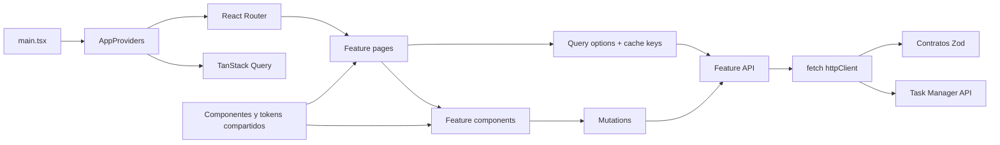

# Task Manager UI

Cliente web del gestor de proyectos y tareas. Está construido con React, Vite,
TypeScript, React Router, TanStack Query y Zod.

## Requisitos

- Node.js 22 o superior.
- pnpm 9.
- La API del proyecto ejecutándose localmente.

## Ejecución local

1. Inicia primero el backend siguiendo su
   [README](../task-manager-backend/README.md). La API debe estar disponible en
   `http://localhost:3000` o `http://127.0.0.1:3000`.

2. En otra terminal, entra a la UI:

   ```bash
   cd task-manager-ui
   ```

3. Instala las dependencias:

   ```bash
   pnpm install --frozen-lockfile
   ```

4. Crea la configuración local:

   ```bash
   cp .env.example .env.local
   ```

   El archivo debe contener la URL pública de la API:

   ```dotenv
   VITE_API_URL=http://127.0.0.1:3000
   ```

5. Inicia Vite:

   ```bash
   pnpm run dev
   ```

6. Abre `http://127.0.0.1:5173/projects`.

Si cambias el host o puerto de Vite, añade ese origen a `CORS_ORIGINS` en el
backend.

## Funcionalidades

- Listado, creación, edición y eliminación de proyectos.
- Board Kanban por proyecto.
- Creación, consulta y edición de tareas.
- Filtros server-side por estado, prioridad y búsqueda.
- Resumen con estado, prioridad, vencimientos y porcentaje de avance.
- Estados de carga, error, vacío y reintento.
- Validación de respuestas y errores HTTP con Zod.

## Rutas

| Ruta                         | Vista                                          |
| ---------------------------- | ---------------------------------------------- |
| `/projects`                  | Listado y gestión de proyectos.                |
| `/projects/:projectId/board` | Board, resumen, filtros y tareas del proyecto. |
| `*`                          | Página no encontrada.                          |

## Arquitectura interna

La UI está organizada por funcionalidades. Las páginas componen componentes y
consumen opciones de consulta; el acceso HTTP y los contratos de datos quedan
fuera de la capa visual.



Estructura principal:

```text
src/
├── app/                  # Providers, router, layout y estilos globales
├── features/
│   ├── projects/         # API, queries, páginas y diálogos de proyectos
│   ├── tasks/            # API, queries y diálogos de tareas
│   └── board/            # Kanban, filtros, indicadores y skeletons
└── shared/
    ├── api/              # Cliente fetch, configuración y errores tipados
    └── components/       # Componentes visuales reutilizables
```

### Flujo de datos

1. React Router resuelve la página y sus parámetros.
2. La página construye las opciones de TanStack Query.
3. La API de la funcionalidad llama al cliente HTTP sobre `fetch`.
4. Zod valida el cuerpo antes de entregarlo a la UI.
5. Las mutaciones actualizan o invalidan la caché correspondiente.
6. Los filtros se conservan en la URL para permitir recarga y navegación.

## Scripts útiles

| Comando            | Descripción                              |
| ------------------ | ---------------------------------------- |
| `pnpm run dev`     | Inicia Vite en desarrollo.               |
| `pnpm run build`   | Comprueba TypeScript y genera `dist`.    |
| `pnpm run preview` | Sirve localmente el build de producción. |
| `pnpm run lint`    | Ejecuta Oxlint y comprueba Prettier.     |
| `pnpm run format`  | Formatea el proyecto.                    |

## Despliegue en Render

El archivo [`../render.yaml`](../render.yaml) publica esta aplicación como sitio
estático, configura `VITE_API_URL` y reescribe las rutas del navegador hacia
`index.html`.
